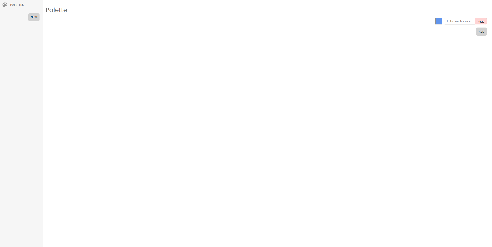
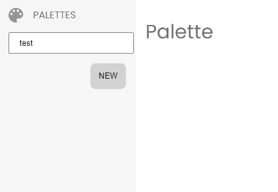
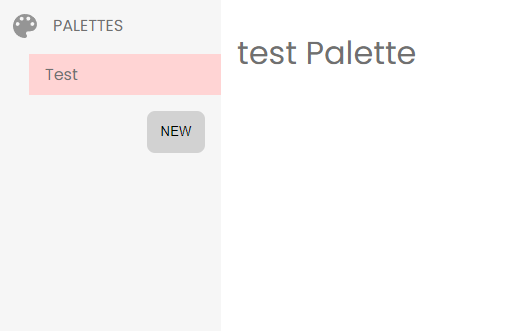
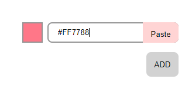
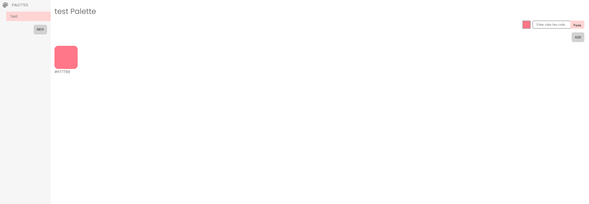
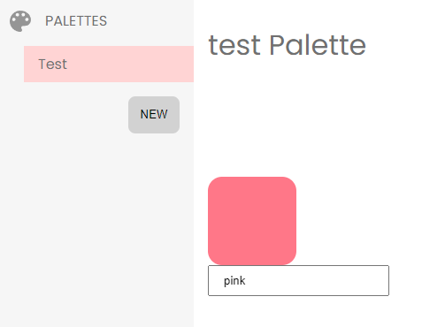
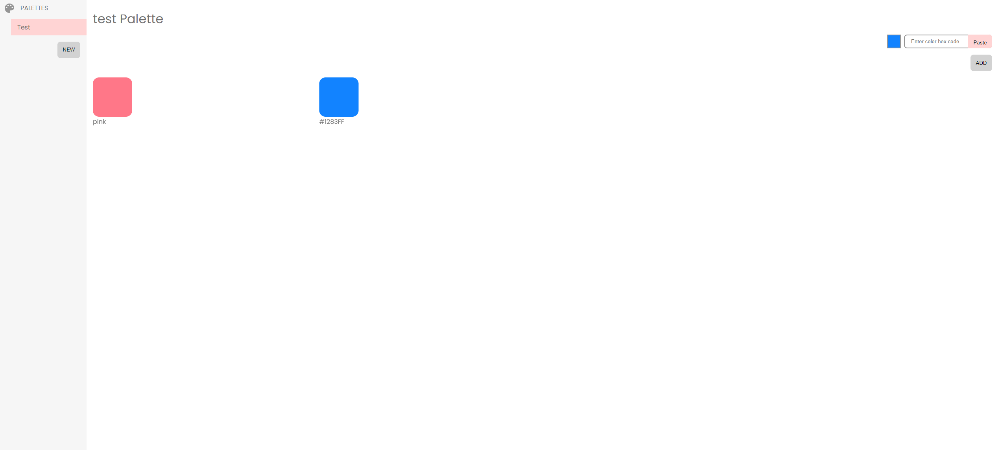
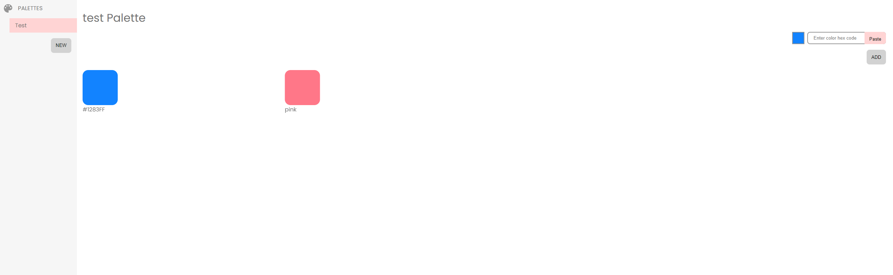
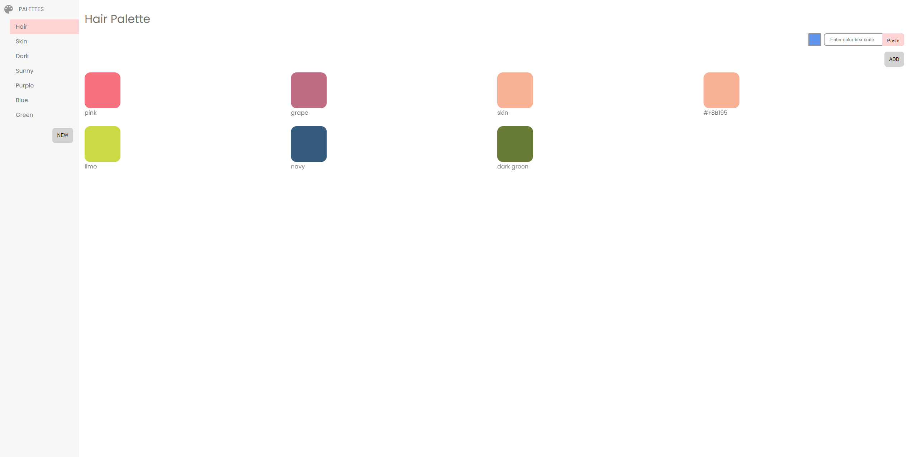

# Copit

Solution to the difficulty in saving specific colour palettes in Clip Studio Art. It allows artists to copy hex code colours, create new palette themes and rearrange colour tiles. Next implementation in mind is to allow users to import palettes to graphic editors.

## How to setup

1. Node.js installed through one of the following:

```
a) download for your OS here: https://nodejs.org/en/download/
b) using homebrew on Linux: brew install node
```

2. Ensure the path to Node.js is in your PATH environment variables under user and system variables.\
   Instructions here: https://love2dev.com/blog/node-is-not-recognized-as-an-internal-or-external-command/
3. In command line, navigate to the root project directory input the following:
   `npm install`
4. Install MongoDB. Follow these instructions for your specific system: https://www.mongodb.com/docs/manual/administration/install-community/
5. Install MongoDB Compass: https://www.mongodb.com/products/compass
6. Once MongoDB Compass is installed, connect to your the localhost server and create a new database named: "colorpic"
7. Within the "colorpic" database, create a collection called "palettes"

## Time to run

1. The first thing you MUST do is start the server to connect to the MongoDB database:

```
node server.js
```

> This makes the database accesible by the actual colorpic application which is achieved by making API requests to localhost:8080.

2. Now we run the colorpic react app:

```
npm run start
```

## How it should look

### When you first start up the app:



### When you add a palette:





### When you add a colour:





### When you rename a colour by double-clicking name:



### When you add another colour:



### When you swap colour tile positions by draging tiles where you want them to be:



### Set of palettes and colours:



> This app is not fully complete and requires more error-checking to be implemented for any edge cases when using this app. It also requires other functionalities such as renaming palettes and deleting colour tiles.
